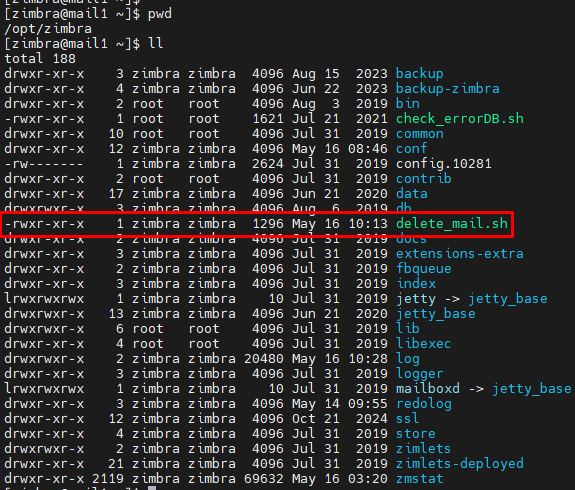
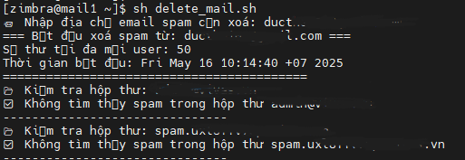
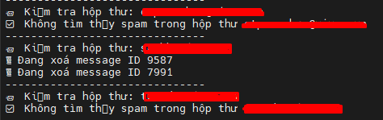

# Các bước thực hiện

## Bước 1: Đăng nhập bằng user zimbra

su - zimbra


## Bước 2: Chạy script delete_mail.sh


**Chạy lệnh**

```sh
sh /opt/zimbra/delete_mail.sh
```

**Kết quả**




- Khi chạy, script sẽ bắt nhập thông tin về mail muốn xóa
-> nhập thông tin mail cần xóa vào

- Nếu có mail đúng thông tin script sẽ thực hiện xóa mail đó khỏi server



# OK


